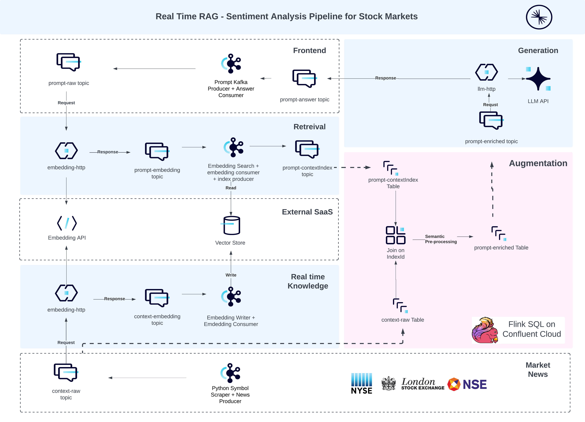

## Confluent Event Driven Workshop 
### GenAI Powered Real time Sentiment Analysis Pipeline 
    With Confluent Cloud Kafka as the central nervous system, the idea to operationalize and adopt GenAI managed services from various hyperscalers looks a very feasible reality. 

### Pre-requiresite 

### Setup 

#### 1. External SaaS

    a. Emebedding API
    b. Vector Store
    c. Managed LLM API 

#### 2. Market News Scrapper App

    a. Stock Symbol & Market Selection 
    b. News Producer Kafka Client

#### 3. Frontend App
    a. Configure Prompt Producer
    b. Configure Answer Consumer

### Real Time Knowledge Pipeline 

#### 1. Connect

    

#### 2. Stream 

