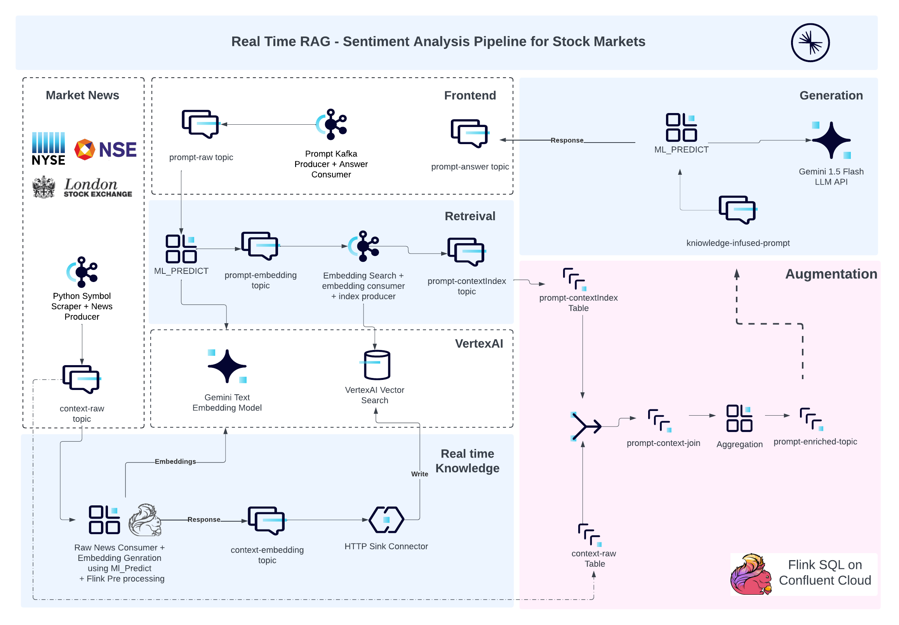

## Confluent Event Driven Workshop 
### GenAI Powered Real time Sentiment Analysis Pipeline 

<p> With Confluent Cloud Kafka as the central nervous system, the idea to operationalize and adopt GenAI managed services from various hyperscalers looks a very feasible reality. This hands-on workshop dives deep into building a real-time sentiment analysis pipeline leveraging the power of FlinkSQL, vector databases, and Large Language Models (LLMs). We'll explore how to:</p>

<p> <b>Harness FlinkSQL for data enrichment:</b> Aggregate real-time financial data and market news analysis, enriching prompts with context retrieved from a vector database using FlinkSQL's powerful JOIN capabilities. </p>
<p><b>Connect to the AI ecosystem:</b> Seamlessly integrate embedding models, LLMs, and external APIs through Kafka Connectors, simplifying communication and data flow.</p>
<p><b>Build scalable pipelines with Confluent Cloud:</b> Leverage the robustness of Confluent Cloud Kafka clusters and Flink compute pools for real-time processing and analysis.</p>



<p><b>Real-World Application:</b> We'll apply these techniques to build a sentiment analysis pipeline, demonstrating how to extract insights from financial data and market news in real-time.</p>

<p><b>Key Takeaways:</b> Participants will gain practical experience with Confluent's <b>Connect, Process, Stream</b> paradigm, enabling them to build and deploy their own real-time RAG pipelines using any context search vector database and LLM HTTP endpoint. This workshop not only provides a stepping stone towards Confluent certification but also unlocks new possibilities for real-time data analysis and decision-making.</p>

##### 


### **Requirements**
```bash    
a. Software: 
    1. Python3 > 3.9
    2. Terraform CLI
    3. Confluent Cloud CLI

b. Access:
    1. Confluent Cloud Account Access 
    2. MongoDB Atlas Account Access
    3. OpenAI API Key - https://platform.openai.com/api-keys
    4. NewsAPI API Key - https://newsapi.org/register
```

### **Setup**

<p> Signup to Confluent Cloud and MongoDB Atlas for Cloud Access </p>

<p> <b>Note:</b> Get your own News API key for free on the given URL. For OpenAI API Key, if you don't have any existing account, you can use your own API key for free, else please reach out to workshop owners to get one.</p>

<p> 1. Navigate to <b>confluent/scripts/scaffold_confluent_cloud.sh</b> and edit the following:</p>

```bash
# confluent/scripts/scaffold_confluent_cloud.sh

export TF_VAR_cc_cloud_api_key="<Confluent Cloud API Key>"
export TF_VAR_cc_cloud_api_secret="<Confluent Cloud API Secret>"
export TF_VAR_mongodbatlas_public_key="<MongoDB Public API Key>"
export TF_VAR_mongodbatlas_private_key="<MongoDB Private API Key>"
export TF_VAR_openai_api_key="<OpenAI API Key - https://platform.openai.com/api-keys>"
export TF_VAR_newsapi_api_key="<NewsAPI Key - https://newsapi.org/register>"
export TF_VAR_company_of_interest="<Company to use for analysis>"
```

<p> 2. After Setting the variables, run: </p>

```bash
./confluent/scripts/scaffold_confluent_cloud.sh
```

<p> 3. Successfull execution of the above script will result in: <br/><br/>a. A file named <b>confluent/outputs.txt</b> being created. <br/> b. Four bash scripts created for each kafka client in <b>app/scripts</b> <br/><br/> Verify the bash scripts env variables and their values from the outputs.txt</p>

```bash
# app/scripts/frontend_app.sh

export CC_KAFKA_RAW_PROMPT_TOPIC=
export CC_KAFKA_PROMPT_RESPONSE_TOPIC=
export CC_CLUSTER_KAFKA_URL=
export CC_CLUSTER_API_KEY=
export CC_CLUSTER_API_SECRET=
export CC_CLUSTER_SR_URL=
export CC_CLUSTER_SR_USER=
export CC_CLUSTER_SR_PASS=

# app/scripts/market_news_scrapper.sh

export COMPANY_OF_INTEREST=
export NEWSAPI_APIKEY=
export CC_KAFKA_RAW_NEWS_TOPIC=
export CC_KAFKA_EMBEDDING_NEWS_TOPIC=
export CC_CLUSTER_KAFKA_URL=
export CC_CLUSTER_API_KEY=
export CC_CLUSTER_API_SECRET=
export CC_CLUSTER_SR_URL=
export CC_CLUSTER_SR_USER=
export CC_CLUSTER_SR_PASS=

# app/scripts/news_embedding_client.sh

export OPENAI_APIKEY=
export CC_KAFKA_RAW_NEWS_TOPIC=
export CC_KAFKA_EMBEDDING_NEWS_TOPIC=
export CC_CLUSTER_KAFKA_URL=
export CC_CLUSTER_API_KEY=
export CC_CLUSTER_API_SECRET=
export CC_CLUSTER_SR_URL=
export CC_CLUSTER_SR_USER=
export CC_CLUSTER_SR_PASS=

# app/scripts/prompt_embedding_client.sh

export CC_KAFKA_RAW_PROMPT_TOPIC=
export CC_KAFKA_PROMPT_CONTEXTINDEX_TOPIC=
export OPENAI_APIKEY=
export CC_CLUSTER_KAFKA_URL=
export CC_CLUSTER_API_KEY=
export CC_CLUSTER_API_SECRET=
export CC_CLUSTER_SR_URL=
export CC_CLUSTER_SR_USER=
export CC_CLUSTER_SR_PASS=
export MONGO_CLUSTER_SERVER_URL=
export MONGO_DATABASE_USER=
export MONGO_DATABASE_PASSWORD=
export MONGO_DATABASE=
export MONGO_COLLECTION=
export MONGO_DATABASE_INDEX=
```

<p><b>Note:</b>If you find any differences between outputs.txt and the above variables, please check the step 1 and re-run step 2</p>

<p>4. Setup the python runtime environment, run:</p>

```bash
./app/scripts/setup_python_app.sh
```
<p>Successfull execution of this script will result in creation of an application build in <b>app/</b> directory and <b>.venv</b> directory created with python requirements in the root.

<p><b>Note:</b> If you are able to reach till this stage, then you are ready to run the kafka client python application, the four apps that we are gonna run are:<br/><br/>1. <b>frontend_app.sh:</b> Responsible for providing CLI for producing question as raw prompt and consuming the response as answers. <br/><br/>2. <b>market_news_scrapper.sh:</b> Responsible for scrapping the market news for the given company and produce to kafka as raw context. <br/><br/>3. <b>news_embedding_client.sh:</b> Responsible for consuming and tokenization of raw context and producing the embedding of the given news article event which is further sinked to the MongoDB Atlas Vector Search Index.<br/><br/>4. <b>prompt_embedding_client.sh:</b> Responsible for consuming and tokenization of raw prompt, performing the vector search in the sinked index and retreiving top matching index ids. Furthermore, producing these index ids to kafka for further processing.</p>


### **Knowledge Workflow**
<p>1. Open a new terminal and run the news scrapper and news tokenizer kafka clients</p>

```bash
./app/scripts/market_news_scrapper.sh
```

<p>2. In a different terminal, run:</p>

```bash
./app/scripts/news_embedding_client.sh
```

<p>3. Verify the data in the respective topics - <b>$CC_KAFKA_RAW_NEWS_TOPIC</b> and <b>$CC_KAFKA_EMBEDDING_NEWS_TOPIC</b>. Also, check if the MongoDB sink connector is healthy and running in connector section on Confluent Cloud.</p>

<p>4. Verify the data sinked to MongoDB database and collection (refer outputs.txt). Also, verify that the index for this collection is active. </p>

<p><b>Note:</b> The index might not be active since the data in collection will occur to exist only after running Step 2. To make sure that the index is active, please run the scaffold command once again:</p>

```bash
./confluent/scripts/scaffold_confluent_cloud.sh
```

### **Inference Workflow**

#### Retrieval: 

<p>1. Open a new terminal and start the prompt embedding client, run:</p>

```bash
./app/scripts/prompt_embedding_client.sh
```

<p>2. In a different terminal, start the frontend, run:</p>

```bash
./app/scripts/frontend_app.sh
```
<p><b>Note:</b> After running this script, you would be asked to enter a question as prompt. Enter a question related to the company of interest for sentiment analysis, please refere to <b>assets/sentiment_analysis_qna.txt</b> for references</p>

<p> 3. Get the Confluent Cloud & Flink SQL parameters from the outputs.txt </p>

```bash
cat confluent/outputs.txt

# Confluent Cloud
CC_ENV_NAME=
CC_CLUSTER_NAME=
CC_CLUSTER_ID=

# Confluent Flink
CC_FLINK_COMPUTE_POOL_NAME=
CC_FLINK_COMPUTE_POOL_ID=
```

<p>4. In a different terminal, open the Flink SQL shell:</p>

```bash
confluent login --save # Enter your username and password. In case of SSO, will be redirected to browser

confluent flink shell --compute-pool <CC_FLINK_COMPUTE_POOL_NAME> --environment <CC_ENV_NAME>
```

<p>5. Inside the flink shell, set the given database as cluster name and check the tables: </p>

```sql 
USE `<CC_CLUSTER_NAME>`;

SHOW TABLES;
```

<p>6. Check the data present in the prompt context table (containing matched index ids against the prompt) and raw context table (containing the actual text against index ids), run:<p>

```bash 
cat outputs.txt

# Confluent Kafka
CC_CLUSTER_API_KEY=
CC_CLUSTER_API_SECRET=
CC_CLUSTER_KAFKA_URL=
CC_KAFKA_RAW_NEWS_TOPIC=
CC_KAFKA_EMBEDDING_NEWS_TOPIC=
CC_KAFKA_RAW_PROMPT_TOPIC=
CC_KAFKA_PROMPT_CONTEXTINDEX_TOPIC=
CC_KAFKA_PROMPT_ENRICHED_TOPIC=
```
<p>In the flink shell, run:</p>

```sql
SELECT * FROM `<CC_KAFKA_RAW_NEWS_TOPIC>`;

SELECT * FROM `<CC_KAFKA_PROMPT_CONTEXTINDEX_TOPIC>`;
```

<p><b>Note:</b> Did you noticed any similarity between the two datasets, what potentially could be the common coloumn to join these two tables ? </p>

#### Augmentation: 

<p>1. In the flink shell, run the query to convert the array of index ids in prompt context table into multiple rows, run: </p>

```sql
SELECT 
    key AS prompt_key, 
    id, 
    prompt, 
    context_index 
FROM 
    PromptContextIndex 
CROSS JOIN UNNEST(context_indexes) AS context_index;
```
<p>Here, the statement "UNNEST" is responsible for exploding the array, while CROSS JOIN is responsible to create a join with the parent table and the table which only has a Coloumn called "context_index"</p>

<p>2. In the flink shell, run the query to create a join table which stores joined context data and prompt data</p>

```sql
CREATE TABLE prompt_context_join
(
 prompt_key BYTES,
  id STRING,
  prompt STRING,
  `description` STRING,
  title STRING,
  content STRING,
  `timestamp` TIMESTAMP(3),
    WATERMARK FOR `timestamp` AS `timestamp` 
);
```
<p>3. In the flink shell, run the query to lookup against the text columns in raw context (ContextRaw) and PromptContextIndex  and join the rows where there is matching index id from the prompt context exploded table and raw context table.</p>

```sql
INSERT INTO prompt_context_join
SELECT 
    p.prompt_key as prompt_key,
    p.id as id,
    p.prompt as prompt,
    c.description AS description,
    c.title AS title,
    c.content AS content,
    now () as `timestamp`
FROM 
    ContextRaw AS c
INNER JOIN 
    (
    SELECT 
        key AS prompt_key, 
        id, 
        prompt, 
        context_index 
        FROM PromptContextIndex CROSS JOIN UNNEST(context_indexes) AS context_index
    ) AS p
ON 
    c.id = p.context_index;
```
<p>Here, timestamp` is added to a watermark column which will be later used for bounded stateful operations to perform streaming aggregations.</p>

<p>4. In the flink shell, create a enhanced_prompt_context_join table which will store the aggregated results(similar matched contextes) for each unique prompt</p>

```sql
CREATE TABLE enhanced_prompt_context_join
(
 prompt_key BYTES,
  id STRING,
  prompt STRING,
  `description` STRING,
  title STRING,
  content STRING,
  `timestamp` TIMESTAMP(3),
    WATERMARK FOR `timestamp` AS `timestamp` 
);
```


```sql
INSERT into enhanced_prompt_context_join
SELECT 
        prompt_key, 
        id, 
        prompt,
        LISTAGG(`description`,'\n') OVER(
        PARTITION BY prompt_key,id,prompt
        ORDER BY `timestamp`
  RANGE BETWEEN INTERVAL '1' HOUR PRECEDING AND CURRENT ROW
    ) AS `description`,
        LISTAGG(title,'\n') OVER(
        PARTITION BY prompt_key,id,prompt
        ORDER BY `timestamp`
  RANGE BETWEEN INTERVAL '1' HOUR PRECEDING AND CURRENT ROW
    ) AS title,
        LISTAGG(content,'\n') OVER(
        PARTITION BY prompt_key,id,prompt
        ORDER BY `timestamp`
  RANGE BETWEEN INTERVAL '1' HOUR PRECEDING AND CURRENT ROW
    ) AS content,
     now () as `timestamp`
    FROM prompt_context_join;
```

<p>Here, the function LISTAGG will collect all the aggregated arrays created while inner join in previous step into one single array.This query aggregates related descriptions, titles, and content for each prompt within a one-hour timeframe, merging them into single fields for each unique prompt entry. It enhances prompt context by providing consolidated, recent information in a structured format to enrich responses. </p>


<p>For ex : A query with 4 matched indexes creates 4 unnested values with it's context data in the previous query and the description , title and content are concatened for every row with previous rows within one hour timeframe generating 4 rows , where the last row for each unique prompt would consist the entire knowledge on the given prompt question. </p>


<p>The next task is to filter out the last aggregated for each unique prompt with the entire knowledge.</p>

<p>5. In the flink sql shell, create a table knowledge_infused_prompt which will contain the entire knowledge for a prompt </p>

```sql
CREATE TABLE knowledge_infused_prompt
(
 prompt_key BYTES,
 id STRING,
 prompt STRING,
 similar_descriptions STRING,
 similar_titles STRING,
 similar_content STRING,
 row_num BIGINT NOT NULL
);
```

<p>5. In the flink sql shell, create a tumbling window with row num partitioned by unique prompt and order it by desc and select the latest record with entire context data</p>

```sql
INSERT INTO `knowledge_infused_prompt`
SELECT `prompt_key`,`id`, `prompt`, `description`, `title`, `content` , `row_num`
FROM (
    SELECT *,
           ROW_NUMBER() OVER (PARTITION BY window_start, window_end, `id`, `prompt`, `prompt_key` ORDER BY `timestamp` DESC) AS row_num
    FROM TABLE(TUMBLE(TABLE `confluent_workshop`.`sentiment_analysis`.`enhanced_prompt_context_join`, DESCRIPTOR(`timestamp`), INTERVAL '10' SECOND))
)
where row_num<=1;
```
<p>6. Check the data in the final table, run:</p>

```sql
SELECT * FROM `knowledge_infused_prompt` ;
```

#### Generation:

<p>Now we have obtained the full context for the prompt we have inserted , the next task is to feed this input to a ML_MODEL to get a desired response for the given prompt with the help of the obtained conext. Let's follow the below series to execute this</p>

<p>1. Check the HTTP Sink connector health and running status in the connector section on confluent cloud. Also verify the topic its consuming the data, this should be same as <b>"CC_KAFKA_PROMPT_ENRICHED_TOPIC"</b></p>

```sql
confluent flink connection create googleai-connection
--cloud GCP \
--region us-east1 \
--type mongo \
--endpoint https://generativelanguage.googleapis.com/v1beta/models/gemini-1.5-flash-latest:generateContent \
--api-key <YOUR_API_KEY>
```

<p>2. Check the success, error and dlq topics created for this connector. The name of the topics would be success, error and dlq suffixed by <b>"-connector_id"</b></p>

```sql
CREATE MODEL RESPONSE_ML_MODEL
INPUT (`text` STRING)
OUTPUT (`output` STRING)
WITH (
  'googleai.connection' = 'googleai-connection',
  'googleai.client_timeout' = '120',
  'googleai.system_prompt' = 'Answer the below question based on given info in JSON format only.',
  'provider' = 'googleai',
  'task' = 'text_generation'
);
```

<p>3. Go to the terminal where the frontend is running, check if you are able to see the answer to question being asked in the prompt previously. </p>

```sql
SELECT prompt_key,id,prompt,output as recommendation
FROM knowledge_infused_prompt,
LATERAL TABLE(
    ML_PREDICT(
        'RESPONSE_ML_MODEL',
        (
            'Question: ' ||
             prompt || ' ' ||
            'Similar descriptions obtained for above question (generated from RAG pipeline): ' || similar_descriptions || ' ' ||
            'Similar titles obtained for above question (generated from RAG pipeline): ' || similar_titles || ' ' ||
            'Similar content obtained for above question (generated from RAG pipeline): ' || similar_content || ' ' 
        )
    )
);
```


```sql
INSERT INTO `<RESPONSE_TOPIC>` 
-- Copy the above select statement here.
```
<p><b>Note:</b> You may now play around by scraping other companies information as well by just changing the following: </p>


```bash
# app/scripts/market_news_scrapper.sh
export COMPANY_OF_INTEREST= # Type the other company of interest.
```

<p>Give a new question in the prompt for this company and see the response.</p>

### **Teardown**

<p>1. Define the following env variables in the file <b>confluent/scripts/teardown_confluent_cloud.sh</b></p>

```bash
export TF_VAR_cc_cloud_api_key=
export TF_VAR_cc_cloud_api_secret=
export TF_VAR_mongodbatlas_public_key=
export TF_VAR_mongodbatlas_private_key=
export TF_VAR_openai_api_key=
export TF_VAR_newsapi_api_key=
export TF_VAR_company_of_interest=
```

<p>2. Run the teardown script:</p>

```bash
./confluent/scripts/teardown_confluent_cloud.sh
```

### **Conclusion**

<p>We were able to demonstrate the realtime RAG capability with Data streaming platform "Kafka" and stream processing platform "Flink". For other such pipelines, you can change the scraped raw context with other kind of real time information and add your own interesting prompt enrichment text for zero shot learning. Also, this could be integrated to any other LLM API, including multimodality Generative and Embedding models.</p>


<!-- 

```bash
# a. Vector Store

export MONGODB_ATLAS_PUBLIC_KEY="xxxx"
export MONGODB_ATLAS_PRIVATE_KEY="xxxx"

cd external
terraform init
terraform apply

cat vector_store.txt

# b. LLM API
cd .. # Navigate to Root 
export OPENAI_APIKEY="xxxx"

./scripts/test_llm_api.sh
```

#### 2. Confluent Cloud Setup

```bash 
# a. Confluent Cloud API 
export CONFLUENT_CLOUD_API_KEY="<cloud_api_key>"
export CONFLUENT_CLOUD_API_SECRET="<cloud_api_secret>"

# b. Setup kafka cluster & flink pool 
cd confluent

terraform init
terraform apply -target confluent_kafka_cluster.default -target confluent_flink_compute_pool.default

# c. Setup the topics required for Frontend and market news scrapper

terraform apply -target confluent_kafka_topic.frontend_prompt_raw -target confluent_kafka_topic.news_context_raw -target confluent_kafka_topic.news_context_embedding -target confluent_kafka_topic.retrieval_prompt_contextindex

# d. Confluent CLI Setup
confluent --help # Check if CLI is installed properly
confluent login # Provide the username & password to signin
confluent env use "<confluent_env>" # Created in 2b
confluent api-key create --resource "<cluster_id>" --description "Cluster Default Key" # Cluster created in 2c

# e. Define the Client properties for kafka clients

```

#### 3. Market News Scrapper App

```bash 
# a. Stock Symbol & Market Selection 

cd .. # Back to root directory
export SCRAP_STOCK_SYMBOL="CFLT"
export STOCK_MARKET="NASDAQ"

# b. News Producer Kafka Client
export CC_CLUSTER_API_KEY="xxxx" # Created in step 2d
export CC_CLUSTER_API_SECRET="xxxx" # Created in step 2d

export CC_CLUSTER_KAFKA_URL="<bootstrap URL>" # Created in step 2b
export CC_KAFKA_RAW_NEWS_TOPIC="<context raw topic>" # Created in step 2c

./scripts/market_news_scrapper.sh
```


### Real Time Knowledge Pipeline 

#### 1. Process
```bash
# a. Export required vars
export CC_KAFKA_RAW_NEWS_TOPIC="<context raw topic>"
export CC_KAFKA_EMBEDDING_NEWS_TOPIC="<context embedding topic>"

# b. Start the news embedding kafka client
./scripts/news_embedding_client.sh

```
#### 2. Connect
```bash
# a. Create Mongo Atlas Sink connector for News Emdedding Upsert to Mongo Atlas Vector Search
cd confluent
terraform apply -target confluent_connector.knowledge_embedding_mongo_sink 

# b. Get the configurations for the created connector 
confluent connect describe "<cc connector id>" # Created above
```

#### 3. Stream 
```bash

# a. Define flink compute pool id and env id 
export CC_FLINK_COMPUTE_POOL_ID="<flink compute pool id>"
export CC_ENV_ID="<confluent env id>"

# b. Log on to flink shell
confluent flink shell --compute-pool ${CC_FLINK_COMPUTE_POOL_ID} --environment ${CC_ENV_ID}

# c. Check messages in the topic table
SELECT * FROM ${CC_KAFKA_EMBEDDING_NEWS_TOPIC}
```

### Retrieval Pipeline

#### 1. Process 

```bash
# a. Export the required the params
export CC_KAFKA_RAW_PROMPT_TOPIC="<>"
export CC_KAFKA_PROMPT_CONTEXTINDEX_TOPIC="<>"
export MONGO_ATLAS_ENDPOINT="<>"
export MONGO_USERNAME="<>"
export MONGO_PASSWORD="<>"

# b. Start the prompt emdedding kafka client
./scripts/prompt_embedding_client.sh
```

#### 2. Stream

```bash
# a. Export the required the params
export CC_FLINK_COMPUTE_POOL_ID="<flink compute pool id>"
export CC_ENV_ID="<confluent env id>"

# b. Log on to flink shell
confluent flink shell --compute-pool ${CC_FLINK_COMPUTE_POOL_ID} --environment ${CC_ENV_ID}

# c. Check messages in the topic table
SELECT * FROM ${CC_KAFKA_PROMPT_CONTEXTINDEX_TOPIC}

```

### Augmentation & Generation Pipeline

#### 1. Process
```bash
# a. Export the required the params
export CC_FLINK_COMPUTE_POOL_ID="<flink compute pool id>"
export CC_ENV_ID="<confluent env id>"

# b. Log on to flink shell
confluent flink shell --compute-pool ${CC_FLINK_COMPUTE_POOL_ID} --environment ${CC_ENV_ID}

# c. Create Enriched Prompt Table

# d. Flink SQL to enrich prompt with context text & semantic pre-processing

# e. Insert the final result to Enriched Prompt Table
```

#### 2. Connect
```bash
# a. Create Mongo Atlas Sink connector for News Emdedding Upsert to Mongo Atlas Vector Search
cd confluent
terraform apply -target confluent_connector.generation_llm_request

# b. Get the configurations for the created connector 
confluent connect describe "<cc connector id>" # Created above
```

#### 3. Stream
```bash 
# a. export Topic for LLM HTTP response
export CC_KAFKA_PROMPT_RESPONSE_TOPIC="<prompt answer topic>" # Get from 2b
export CC_FLINK_COMPUTE_POOL_ID="<flink compute pool id>"
export CC_ENV_ID="<confluent env id>"

# b. Log on to flink shell
confluent flink shell --compute-pool ${CC_FLINK_COMPUTE_POOL_ID} --environment ${CC_ENV_ID}

# c. Check messages in the topic table
SELECT * FROM ${CC_KAFKA_PROMPT_RESPONSE_TOPIC}
```

### Frontend App Testing
```bash
# a. Define required vars
export CC_KAFKA_RAW_PROMPT_TOPIC="<prompt raw topic>"
export CC_KAFKA_PROMPT_RESPONSE_TOPIC="<prompt answer topic>"

# b. Start the frontend app
./scripts/frontend_app.sh

# c. Produce the prompt as input and check the answers

# d. Check the answer & modify as per the need
```

### Teardown

```bash 
# a. Destroy Confluent resources
cd confluent
terraform destroy

# b. Destroy Mongo Resources
cd external
terraform destroy

# c. Stop all the running scripts
``` -->
