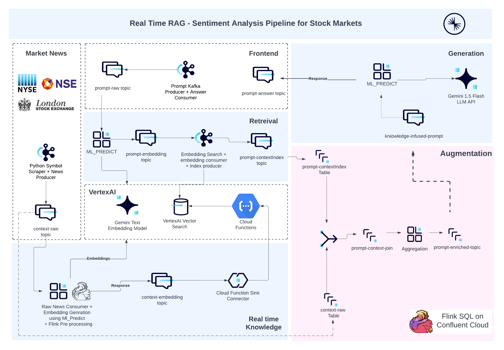

## Confluent Event Driven Workshop 
### GenAI Powered Real time Sentiment Analysis Pipeline 

<p> With Confluent Cloud Kafka as the central nervous system, the idea to operationalize and adopt GenAI managed services from various hyperscalers looks a very feasible reality. This hands-on workshop dives deep into building a real-time sentiment analysis pipeline leveraging the power of FlinkSQL, FlinkAI, vector databases, and Large Language Models (LLMs). We'll explore how to:</p>

<p> <b>Harness FlinkSQL for data enrichment:</b> Aggregate real-time financial data and market news analysis, enriching prompts with context retrieved from a vector database using FlinkSQL's powerful JOIN capabilities. </p>
<p><b>Connect to the AI ecosystem:</b> Seamlessly integrate embedding models and LLMs with FlinkAI ,external APIs through Kafka Connectors, simplifying communication and data flow.</p>
<p><b>Build scalable pipelines with Confluent Cloud:</b> Leverage the robustness of Confluent Cloud Kafka clusters and Flink compute pools for real-time processing and analysis.</p>



<p><b>Real-World Application:</b> We'll apply these techniques to build a sentiment analysis pipeline, demonstrating how to extract insights from financial data and market news in real-time.</p>

<p><b>Key Takeaways:</b> Participants will gain practical experience with Confluent's <b>Connect, Process, Stream</b> paradigm, enabling them to build and deploy their own real-time RAG pipelines using any context search vector database and LLM HTTP endpoint. This workshop not only provides a stepping stone towards Confluent certification but also unlocks new possibilities for real-time data analysis and decision-making.</p>

##### 


### **Requirements**
```bash    
a. Software: 
    1. Python3 > 3.9
    2. Terraform CLI
    3. Confluent Cloud CLI
    4. Google Cloud CLI

b. Access:
    1. Confluent Cloud Account Access 
    2. Google Cloud / Qwiklabs Account Access
    3. NewsAPI API Key - https://newsapi.org/register
```

### **Setup**

<p> Signup to Confluent Cloud and ensure you have qwiklabs google cloud access </p>

<p> <b>Note:</b> Get your own News API key for free on the given URL.</p>

### Authenticate your Google Cloud account
```
gcloud auth login

gcloud auth application-default login  

```

<p> 1. Navigate to <b>confluent/scripts/scaffold_confluent_cloud.sh</b> and edit the following:</p>

```bash
# confluent/scripts/scaffold_confluent_cloud.sh

export TF_VAR_cc_cloud_api_key="<Confluent Cloud API Key>"
export TF_VAR_cc_cloud_api_secret="<Confluent Cloud API Secret>"
export TF_VAR_newsapi_api_key="<NewsAPI Key - https://newsapi.org/register>"
export TF_VAR_company_of_interest="<Company to use for analysis>"
export TF_VAR_identifier="<Unique Identifier your name/team name[In small caps]>"
export TF_VAR_project_id="<GCP project ID>"
```

<p> 2. After Setting the variables, run: </p>

```bash
./confluent/scripts/scaffold_confluent_cloud.sh
```

<p> 3. Successfull execution of the above script will result in: <br/><br/>a. A file named <b>confluent/outputs.txt</b> being created. <br/> b. Four bash scripts created for each kafkagoogleai client in <b>app/scripts</b> <br/><br/> Verify the bash scripts env variables and their values from the outputs.txt</p>

```bash
# app/scripts/frontend_app.sh

export CC_KAFKA_RAW_PROMPT_TOPIC=
export CC_CLUSTER_KAFKA_URL=
export CC_CLUSTER_API_KEY=
export CC_CLUSTER_API_SECRET=
export CC_CLUSTER_SR_URL=
export CC_CLUSTER_SR_USER=
export CC_CLUSTER_SR_PASS=

# app/scripts/market_news_scrapper.sh

export COMPANY_OF_INTEREST=
export NEWSAPI_APIKEY=
export CC_KAFKA_RAW_NEWS_TOPIC=
export CC_KAFKA_EMBEDDING_NEWS_TOPIC=
export CC_CLUSTER_KAFKA_URL=
export CC_CLUSTER_API_KEY=
export CC_CLUSTER_API_SECRET=
export CC_CLUSTER_SR_URL=
export CC_CLUSTER_SR_USER=
export CC_CLUSTER_SR_PASS=

# app/scripts/news_embedding_client.sh


export CC_KAFKA_RAW_NEWS_TOPIC=
export CC_KAFKA_EMBEDDING_NEWS_TOPIC=
export CC_CLUSTER_KAFKA_URL=
export CC_CLUSTER_API_KEY=
export CC_CLUSTER_API_SECRET=
export CC_CLUSTER_SR_URL=
export CC_CLUSTER_SR_USER=
export CC_CLUSTER_SR_PASS=

# app/scripts/prompt_embedding_client.sh

export CC_KAFKA_RAW_PROMPT_TOPIC=
export CC_PROMPT_EMBEDDING_TOPIC=
export CC_KAFKA_PROMPT_CONTEXTINDEX_TOPIC=
export CC_CLUSTER_KAFKA_URL=
export CC_CLUSTER_API_KEY=
export CC_CLUSTER_API_SECRET=
export CC_CLUSTER_SR_URL=
export CC_CLUSTER_SR_USER=
export CC_CLUSTER_SR_PASS=
export LOCATION=
export PROJECT=
export INDEX_ENDPOINT=
export DEPLOYED_INDEX_ID=
```

<p><b>Note:</b>If you find any differences between outputs.txt and the above variables, please check the step 1 and re-run step 2</p>

<p>4. Setup the python runtime environment, run:</p>

```bash
./app/scripts/setup_python_app.sh
```
<p>Successfull execution of this script will result in creation of an application build in <b>app/</b> directory and <b>.venv</b> directory created with python requirements in the root.

<p><b>Note:</b> If you are able to reach till this stage, then you are ready to run the kafka client python application, the three apps that we are gonna run are:<br/><br/>1. <b>frontend_app.sh:</b> Responsible for providing CLI for producing question as raw prompts. <br/><br/>2. <b>market_news_scrapper.sh:</b> Responsible for scrapping the market news for the given company and produce to kafka as raw context. <br/><br/>3. <b>prompt_embedding_client.sh:</b> Responsible for consuming and tokenization of raw prompt, performing the vector search in the sinked index and retreiving top matching index ids. Furthermore, producing these index ids to kafka for further processing.</p>


### **Knowledge Workflow**
<p>1. Open a new terminal and run the news scrapper and news tokenizer kafka clients</p>

```bash
./app/scripts/market_news_scrapper.sh
```
<p>2. Login to your confluent cloud account to see the different resources deployed on your environment.Make a not of your environment id</p>

<p>3. In a different terminal, run:</p>

```bash
confluent login --save 
confluent use env --<YOUR_ENVIRONMENT_ID>
confluent flink connection create vertexai-embedding-connection  --cloud GCP \
--region us-central1 \
--type vertexai \
--endpoint https://us-central1-aiplatform.googleapis.com/v1/projects/<YOUR_PROJECT_ID>/locations/us-central1/publishers/google/models/text-embedding-004:predict \
--service-key "$(cat confluent/credentials/service_account_key.json)"
```

<p>3. Log in to your confluent cloud env and access flink workspace(UI tool to run your flinksql queries) to run following queries:</p>

```sql
CREATE MODEL EMBEDDING_MODEL
INPUT (`text` STRING)
OUTPUT (`output` ARRAY<FLOAT>)
WITH (
  'vertexai.connection' = 'vertexai-embedding-connection',
  'provider' = 'vertexai',
  'vertexai.input_format' = 'VERTEX-EMBED',
  'task' = 'embedding'
);
```

```sql
INSERT INTO `<CC_KAFKA_EMBEDDING_NEWS_TOPIC>`
SELECT CAST(id AS BYTES),id,`output` as knowledge_embedding,published_at,`source` FROM ContextRaw, 
LATERAL TABLE(
    ML_PREDICT(
        'EMBEDDING_MODEL',(
            'title: ' || title || ', ' ||
            'description: ' || description || ', ' ||
            'content: ' || content || ', ' ||
            'published_at: ' || published_at
        )
    )
);
```


<p>3. Verify the data in the respective topics - <b>$CC_KAFKA_RAW_NEWS_TOPIC</b> and <b>$CC_KAFKA_EMBEDDING_NEWS_TOPIC</b>. Also, check if the Context Sink Connector(Cloud Function Sink Connector) is healthy and running in connector section on Confluent Cloud.</p>

<p>4. Verify the data sinked to VertexAI Vector Search using the success topic success-lcc-[...]. </p>

<p>4. This completes your knowledge workflow.Now we have context data stored into vector search and pipeline for upcoming real time context.</p>

### **Inference Workflow**

#### Retrieval: 

<p>1. In a different terminal, start the frontend, run:</p>

```bash
./app/scripts/frontend_app.sh
```
<p><b>Note:</b> After running this script, you would be asked to enter a question as prompt. Enter a couple of questions related to the company of interest for sentiment analysis, please refere to <b>assets/sentiment_analysis_qna.txt</b> for references. Keep the producer running to insert continous stream of data in the later part of workshop.</p>


<p>2. Open a new terminal and start the prompt embedding client, run:</p>

```bash
./app/scripts/prompt_embedding_client.sh
```
<p><b>Note:</b>Complete the next step to see data coming through the script.</p>


<p>3.Now let's setup a function which creates embeddings for the prompts entered in the above step. Go to the FlinkSQL workspace and run the below query utilizing embedding model created in knowledge workflow.</p>

```sql
INSERT INTO `<CC_PROMPT_EMBEDDING_TOPIC>`
SELECT CAST(id AS BYTES),`output` as embedding_vector,id,prompt,`timestamp` FROM `<CC_KAFKA_RAW_PROMPT_TOPIC>`, 
LATERAL TABLE(
    ML_PREDICT(
        'EMBEDDING_MODEL',(
            'prompt: ' || prompt 
        )
    )
);
```
<p>4.Verify the data in the respective topics <b>$CC_PROMPT_EMBEDDING_TOPIC</b> and <b>$CC_KAFKA_PROMPT_CONTEXTINDEX_TOPIC</b> </p>


<p>5. Open up the flinkSQL workspace on to the confluent UI:</p>


<p>5. Inside the flink workspace, set the given database as cluster name and check the tables: </p>

```sql 
SHOW TABLES;
```

<p>6. Check the data present in the promptcontextindex table (containing matched index ids against the prompt) and raw context table (containing the actual text against index ids), run:<p>

```sql
SELECT * FROM `<CC_KAFKA_RAW_NEWS_TOPIC>`;

SELECT * FROM `<CC_KAFKA_PROMPT_CONTEXTINDEX_TOPIC>`;
```

<p><b>Note:</b> Did you noticed any similarity between the two datasets, what potentially could be the common coloumn to join these two tables ? </p>

#### Augmentation: 

<p>1. In the flink shell, run the query to convert the array of index ids in prompt context table into multiple rows, run: </p>

```sql
SELECT 
    key AS prompt_key, 
    id, 
    prompt, 
    context_index 
FROM 
    PromptContextIndex 
CROSS JOIN UNNEST(context_indexes) AS context_index;
```
<p>Here, the statement "UNNEST" is responsible for exploding the array, while CROSS JOIN is responsible to create a join with the parent table and the table which only has a Coloumn called "context_index"</p>

<p>2. In the flink shell, run the query to create a join table which stores joined context data and prompt data</p>

```sql
CREATE TABLE PromptContextJoin
(
 prompt_key BYTES,
  id STRING,
  prompt STRING,
  `description` STRING,
  title STRING,
  content STRING,
  `timestamp` TIMESTAMP(3),
    WATERMARK FOR `timestamp` AS `timestamp` 
);
```
<p>3. In the flink shell, run the query to lookup against the text columns in raw context (ContextRaw) and PromptContextIndex  and join the rows where there is matching index id from the prompt context exploded table and raw context table.</p>

```sql
INSERT INTO PromptContextJoin
SELECT 
    p.prompt_key as prompt_key,
    p.id as id,
    p.prompt as prompt,
    c.description AS description,
    c.title AS title,
    c.content AS content,
    now () as `timestamp`
FROM 
    ContextRaw AS c
INNER JOIN 
    (
    SELECT 
        key AS prompt_key, 
        id, 
        prompt, 
        context_index 
        FROM PromptContextIndex CROSS JOIN UNNEST(context_indexes) AS context_index
    ) AS p
ON 
    c.id = p.context_index;
```
<p>Here, timestamp` is added to a watermark column which will be later used for bounded stateful operations to perform streaming aggregations.</p>

<p>4. In the flink shell, create a enhanced_prompt_context_join table which will store the aggregated results(similar matched contextes) for each unique prompt</p>

```sql
CREATE TABLE EnhancedPromptContextJoin
(
 prompt_key BYTES,
  id STRING,
  prompt STRING,
  `description` STRING,
  title STRING,
  content STRING,
  `timestamp` TIMESTAMP(3),
    WATERMARK FOR `timestamp` AS `timestamp` 
);
```


```sql
INSERT into EnhancedPromptContextJoin
SELECT 
        prompt_key, 
        id, 
        prompt,
        LISTAGG(`description`,'\n') OVER(
        PARTITION BY prompt_key,id,prompt
        ORDER BY `timestamp`
  RANGE BETWEEN INTERVAL '1' HOUR PRECEDING AND CURRENT ROW
    ) AS `description`,
        LISTAGG(title,'\n') OVER(
        PARTITION BY prompt_key,id,prompt
        ORDER BY `timestamp`
  RANGE BETWEEN INTERVAL '1' HOUR PRECEDING AND CURRENT ROW
    ) AS title,
        LISTAGG(content,'\n') OVER(
        PARTITION BY prompt_key,id,prompt
        ORDER BY `timestamp`
  RANGE BETWEEN INTERVAL '1' HOUR PRECEDING AND CURRENT ROW
    ) AS content,
     now () as `timestamp`
    FROM PromptContextJoin;
```

<p>Here, the function LISTAGG will collect all the aggregated arrays created while inner join in previous step into one single array.This query aggregates related descriptions, titles, and content for each prompt within a one-hour timeframe, merging them into single fields for each unique prompt entry. It enhances prompt context by providing consolidated, recent information in a structured format to enrich responses. </p>


<p>For ex : A query with 4 matched indexes creates 4 unnested values with it's context data in the previous query and the description , title and content are concatened for every row with previous rows within one hour timeframe generating 4 rows , where the last row for each unique prompt would consist the entire knowledge on the given prompt question. </p>


<p>The next task is to filter out the last aggregated for each unique prompt with the entire knowledge.</p>

<p>5. In the flink sql shell, create a table knowledge_infused_prompt which will contain the entire knowledge for a prompt </p>

```sql
CREATE TABLE KnowledgeInfusedPrompt
(
 prompt_key BYTES,
 id STRING,
 prompt STRING,
 similar_descriptions STRING,
 similar_titles STRING,
 similar_content STRING,
 row_num BIGINT NOT NULL
);
```

<p>5. In the flink sql shell, create a tumbling window with row num partitioned by unique prompt and order it by desc and select the latest record with entire context data</p>

```sql
INSERT INTO `KnowledgeInfusedPrompt`
SELECT `prompt_key`,`id`, `prompt`, `description`, `title`, `content` , `row_num`
FROM (
    SELECT *,
           ROW_NUMBER() OVER (PARTITION BY window_start, window_end, `id`, `prompt`, `prompt_key` ORDER BY `timestamp` DESC) AS row_num
    FROM TABLE(TUMBLE(TABLE `confluent_workshop`.`sentiment_analysis`.`EnhancedPromptContextJoin`, DESCRIPTOR(`timestamp`), INTERVAL '10' SECOND))
)
where row_num<=1;
```
<p>6. Check the data in the final table, run:</p>

```sql
SELECT * FROM `KnowledgeInfusedPrompt` ;
```

#### Generation:

<p>Now we have obtained the full context for the prompt we have inserted , the next task is to feed this input to a ML_MODEL to get a desired response for the given prompt with the help of the obtained conext. Let's follow the below series to execute this</p>

<p>1. Create a flink sql connection to latest gemini model, similar to how we created for the embedding model</p>

```sql
confluent flink connection create gemini-flash-connection \
--cloud GCP \
--region us-central1 \
--type vertexai \
--endpoint https://us-central1-aiplatform.googleapis.com/v1/projects/<YOUR_PROJECT_ID>/locations/us-central1/publishers/google/models/gemini-1.5-flash-002:generateContent \
--service-key "$(cat confluent/credentials/service_account_key.json)"

```

<p>2. Create a model with the above connection which will help to generate a text based response.</p>

```sql
CREATE MODEL RESPONSE_ML_MODEL
INPUT (`text` STRING)
OUTPUT (`output` STRING)
WITH (
  'vertexai.connection' = 'gemini-flash-connection',
  'vertexai.client_timeout' = '120',
  'vertexai.system_prompt' = 'Answer the below question based on given related info .',
  'provider' = 'vertexai',
  'task' = 'text_generation'
);
```

<p>3. Run a ML_PREDICT on the above model with knowledge infused prompt generated in the previous steps. </p>

```sql
SELECT CAST(id AS BYTES),id,prompt,output as response
FROM <Knowledge_Infused_Prompt_Topic_Name>,
LATERAL TABLE(
    ML_PREDICT(
        'RESPONSE_ML_MODEL',
        (
            'Question: ' ||
             prompt || ' ' ||
            'Similar/Related descriptions obtained for above question (generated from RAG pipeline): ' || similar_descriptions || ' ' ||
            'Similar/Related titles obtained for above question (generated from RAG pipeline): ' || similar_titles || ' ' ||
            'Similar/Related content obtained for above question (generated from RAG pipeline): ' || similar_content || ' ' 
        )
    )
);
```

<p>4. Check outputs.txt to see value for <CC_RESPONSE_TOPIC></p>
```sql
INSERT INTO `<CC_RESPONSE_TOPIC>` 
-- Copy the above select statement here.
```
<p><b>Note:</b> You may now play around by scraping other companies information as well by just changing the following: </p>


```bash
# app/scripts/market_news_scrapper.sh
export COMPANY_OF_INTEREST= # Type the other company of interest.
```

<p>Give a new question in the prompt for this company and see the response.</p>

### **Teardown**

<p>1. Define the following env variables in the file <b>confluent/scripts/teardown_confluent_cloud.sh</b></p>

```bash
export TF_VAR_cc_cloud_api_key="<Confluent Cloud API Key>"
export TF_VAR_cc_cloud_api_secret="<Confluent Cloud API Secret>"
export TF_VAR_newsapi_api_key="<NewsAPI Key - https://newsapi.org/register>"
export TF_VAR_company_of_interest="<Company to use for analysis>"
export TF_VAR_identifier="<Unique Identifier your name/team name[In small caps]>"
export TF_VAR_project_id="<GCP project ID>"
```

<p>2. Run the teardown script:</p>

```bash
./confluent/scripts/teardown_confluent_cloud.sh
```

### **Conclusion**

<p>We were able to demonstrate the realtime RAG capability with Data streaming platform "Kafka" and stream processing platform "Flink". For other such pipelines, you can change the scraped raw context with other kind of real time information and add your own interesting prompt enrichment text for zero shot learning. Also, this could be integrated to any other LLM API, including multimodality Generative and Embedding models.</p>
